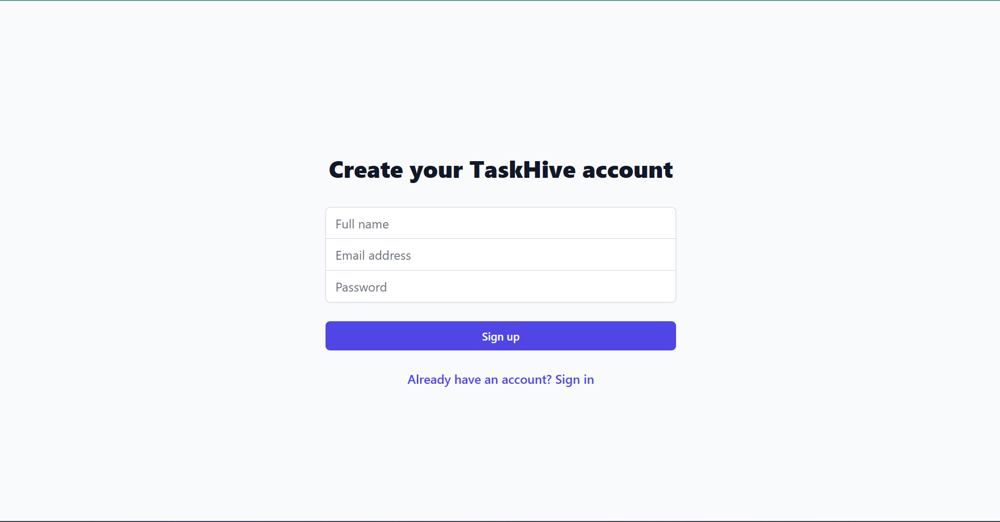
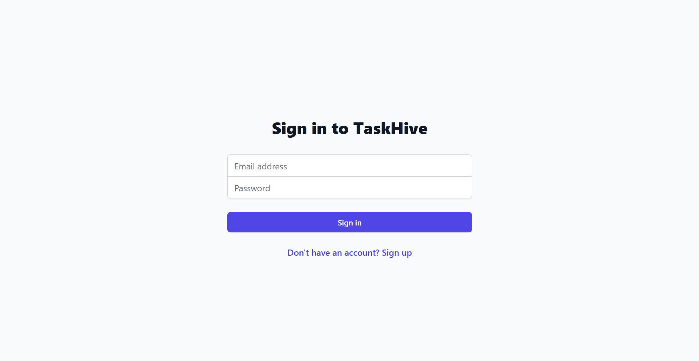
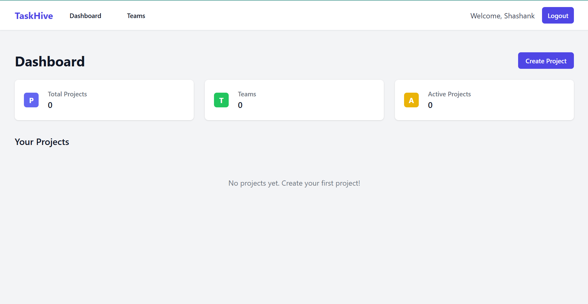
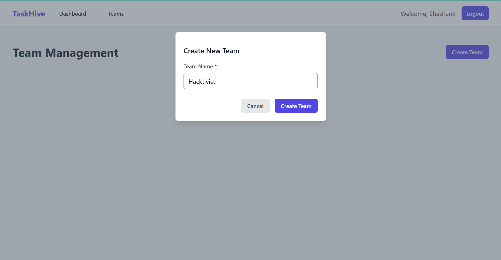
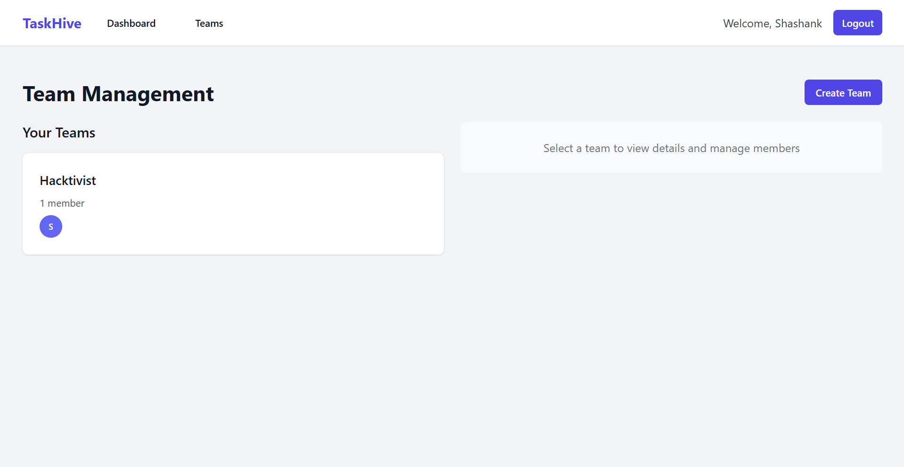
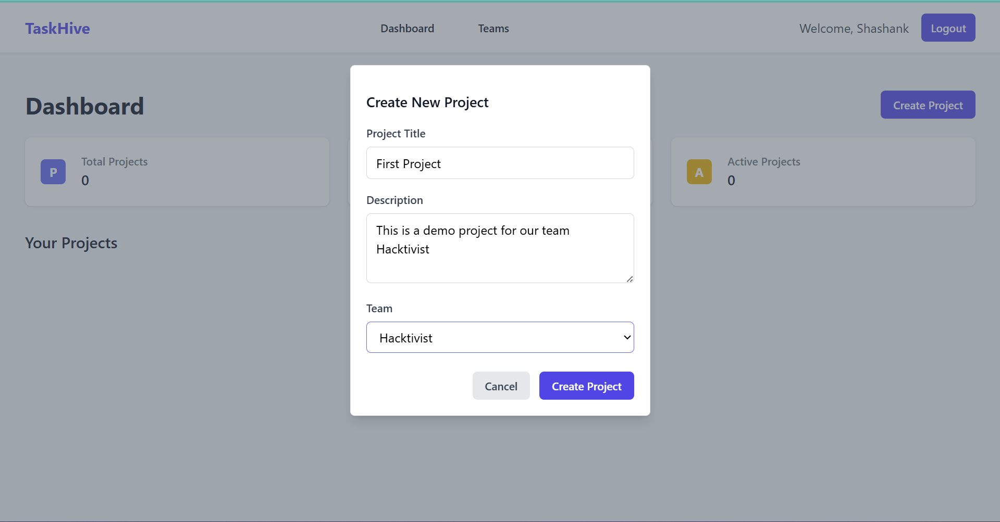
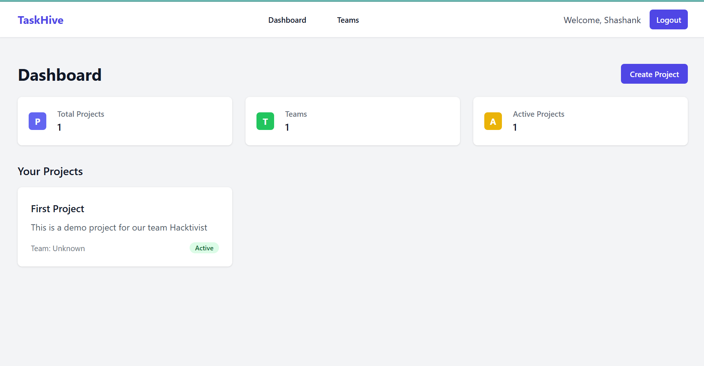
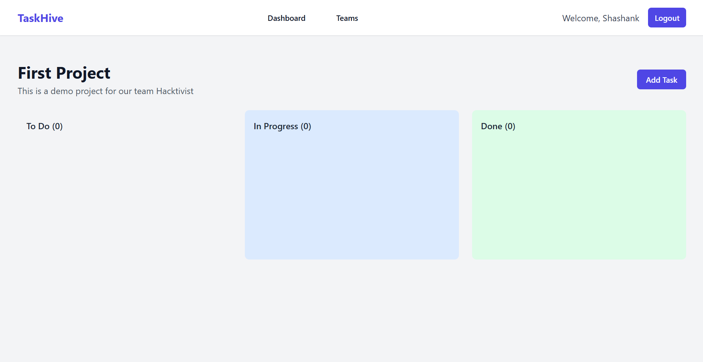
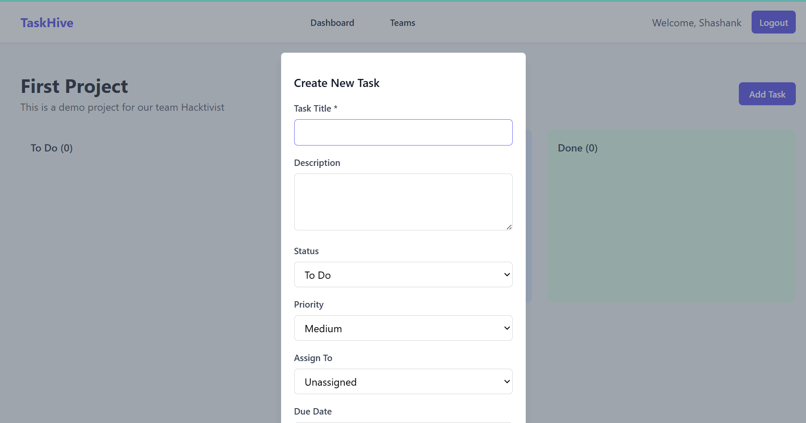
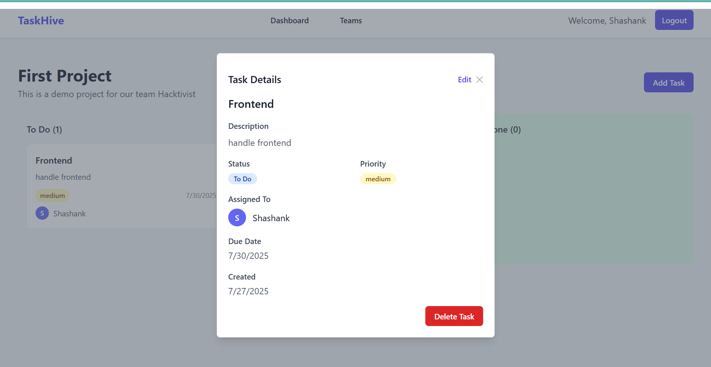

# 🧠 TaskHive – Team-Based Productivity & Task Management App

**TaskHive** is a full-stack MERN application for managing teams, projects, and tasks using a Kanban-style board. It supports user authentication, role-based access, and real-time collaboration features.

---


### 📷 Screenshots

#### 🔐 Sign Up Page


#### 🏠 Sign In Page


#### 🏠 Dashboard Page


#### 🏠 Team Create


#### 🧑‍🤝‍🧑 Team Management


#### 🧑‍🤝‍🧑 Project


#### 🧑‍🤝‍🧑 Project


#### 📋 Kanban Board


#### ➕ Create Task


#### ✅ Task Completed View



## 📁 Project Structure

buzzhive/
├── backend/ # Node.js + Express API
└── frontend/ # React + Vite frontend

---

## 🚀 Features

### ✅ Frontend (React + Vite)

- 🔐 JWT-based user registration and login
- 🏠 Dashboard with project overview
- 📋 Kanban board (To Do, In Progress, Done)
- 🧑‍🤝‍🧑 Team creation and management
- ✍️ Task creation, editing, assignment
- 🔒 Protected routes using React Context
- 🎨 Tailwind CSS for responsive UI
- 🔄 Drag-and-drop support with `react-beautiful-dnd`

### ✅ Backend (Node.js + Express)

- 🔐 JWT authentication and middleware
- 🧾 REST APIs for user, team, project, and task management
- 🔐 Role-based access control (admin/member)
- 🧠 Mongoose models for Users, Teams, Projects, Tasks
- 🌐 MongoDB Atlas for cloud database

---

## 📦 Tech Stack

- **Frontend:** React, Vite, Tailwind CSS, React Router, Axios
- **Backend:** Node.js, Express, MongoDB, Mongoose, JWT
- **Others:** dotenv, bcrypt, cors, react-beautiful-dnd

---

## ⚙️ Setup Instructions

### 📌 Backend Setup

```bash
cd backend
npm install
npm run dev
```

### 📌 Frontend Setup

```bash
cd frontend
npm install
npm run dev
```
